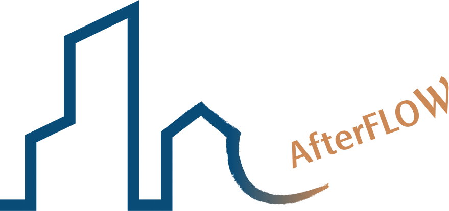

# AfterFLOW | 建築再生主題網站

> 「當風流過之後，建築還會記得什麼？」  
> *When the wind has passed, what whispers will the building keep within its walls?*  
          
＿          
## 專案背景 (Concept)
**AfterFLOW** 是一個探索「建築再生」的建築團隊網站。

### 品牌理念：  

*「建築的生命週期不該止於老舊，『拆除重建』也並非唯一解答。」*   

**AfterFLOW** 希望呈現建築再生的多元樣貌，向大眾傳遞新的修繕思維：當空間隨著歲月老化時，除了夷為平地蓋新的，其實還能透過設計與整理，賦予老屋新的機能與價值。

本專案運用網頁技術，將建築再生的過程具象化 —— 像風一樣，不強硬地破壞，而是柔軟地流動與轉化。在保留舊有工法、記憶與情感的同時，順應現代的需求優雅地延續下去。  

＿     
### 品牌命名：

中文名稱「起風了」 與英文名稱 「AfterFLOW」 之間存在一場關於時間與變化的對話：

* **起風了 :** 象徵「改變的開端」。如同氣流因溫差而擾動，建築的改變也始於需求的更迭，是一個動態的、正在發生的瞬間。

* **AfterFLOW :** 探討的是「變化之後」。當風吹拂過後，空氣歸於平靜，那麼空間留下了什麼？
    
我們希望傳達的是：在經歷了「更新」的流動之後，建築不應只是被抹除，而是留下了更珍貴的記憶與新的生命形式。

＿     

### 兩大核心客群：
1.  **個人業主**：視建築為承載家族記憶的容器，追求結構安全與空間敘事性。
2.  **文化與商業機構**：如藝廊或精品酒店，尋求透過建築再生強化品牌精神與社會責任 (CSR)。  

＿   

*線上預覽 (Live Demo) :* [https://irenewhc.github.io/AfterFLOW/Home/](https://irenewhc.github.io/AfterFLOW/Home/)  
*簡報 :* [https://irenewhc.pse.is/8m6k32](https://irenewhc.pse.is/8m6k32) 

---

## 技術架構與套件 (Tech Stack & Libraries)

專案使用原生前端技術開發，並整合多個 JavaScript Library 來實現「流動感」的視覺體驗：

### 核心技術 (Core)
* **HTML5 / CSS3** (Flexbox & Grid Layout)
* **JavaScript (ES6) / jQuery**
* **RWD** (Responsive Web Design)  

＿     
### 動畫與特效實作 (Plugins & Effects)
為了呈現「風」與「時間」的流動，專案中實作了以下套件：
* **[Vegas.js](https://vegas.jaysalvat.com/):** 用於首頁的全螢幕背景輪播，營造沉浸式的視覺開場。
* **[OwlCarousel2](https://owlcarousel2.github.io/OwlCarousel2/):** 應用於 `Partner` 與 `Article` 區塊，製作響應式的卡片輪播效果。
* **[Textillate.js](https://textillate.js.org/):** 用於標題與 Slogan 的文字進場動畫，模擬風吹拂文字的動態感。

---

## 設計系統 (Design System)

### 標誌設計 (Logo Concept)
以建築有稜角的線條為起點，結尾轉化為風的柔軟弧度與筆刷感，象徵「未完待續」的生命力。  

  

＿     
### 色彩計畫 (Color Palette)
以「風」為概念，運用形成風的元素－海洋、土地進行延伸，並依據元素在地球表面的分佈比例 3 : 7 調配漸層色：
* **泥土金 (Gold)** `#CC8956`: 象徵土地與人文的溫暖。
* **海洋藍 (Blue)** `#0A4C78`: 象徵流動與傳承的深邃。  

＿     
### 字體與排版規範 (Typography & Layout)
全站字體採用 **Noto Sans TC**，並設定 `html` 基準字級為 `62.5%` (10px)，方便使用 `rem` 進行響應式計算。

| 元素 (Element) | 字級 (Font Size) | 行高 (Line Height) | 備註 (Note) |
| :--- | :--- | :--- | :--- |
| **Global (html)** | `62.5%` (10px) | - | 字距 `0.2em`，背景色 `#fff` |
| **H1** | `3.2rem` | `200%` | 主要標題 |
| **H2** | `2.4rem` | `200%` | 次要標題 |
| **H3** | `2.2rem` | `200%` | - |
| **H4** | `2.0rem` | `200%` | - |
| **H5** | `1.8rem` | `200%` | - |
| **H6** | `1.6rem` | `200%` | - |
| **Paragraph (p)** | `1.4rem` | `200%` | 內文 |
| **Reset (*)** | - | - | `box-sizing: border-box` |

---

## 網站地圖 (Sitemap & Features)

專案規劃了完整的資訊架構，包含以下頁面與功能：

* **Home (首頁):** 全螢幕形象 Banner、最新團隊案例 (Event)、精選建築專欄 (Article)。
* **About (關於我們):** 品牌理念闡述、設計風格介紹。
* **Partner (合作夥伴):** 展示建築師、工程團隊與設計師陣容。
* **Event (團隊實績):** 展示本團隊實際執行的改建案例，包含商業空間、私人住宅與公共空間。
* **Article (建築專欄):** 分享各種建築再生的知識文章與國內外經典案例解析（非本團隊作品）。
* **FAQ (常見問題):** 法規權益、結構安全、成本估算等改建諮詢。
* **Contact (聯絡):** 合作邀約與諮詢表單。

---

## 參考資料 (References)

在開發與設計過程中，參考了以下資源：
* **Case Studies:** [ArchDaily - Cultural Spaces Adaptive Reuse](https://www.archdaily.com/)
* **Layout Inspiration:** [hitoba-office.com](https://hitoba-office.com/)

---

### 作者與聲明 (Credits)
* **Developer:** 鄭琬馨 (Irene Cheng)
---
© Copyright 2025-2026 AfterFLOW Lab
